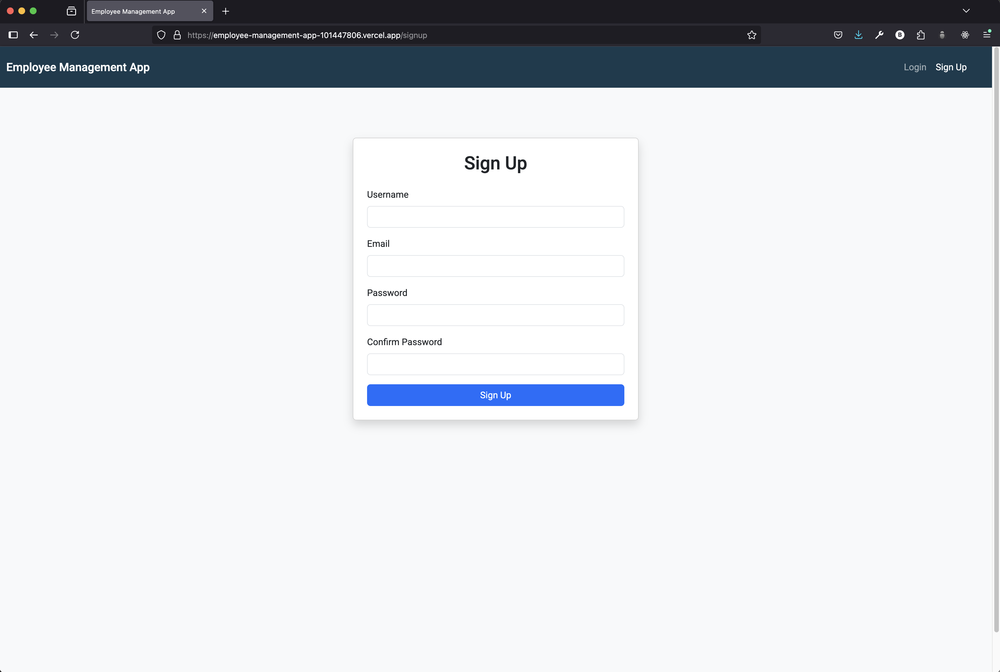
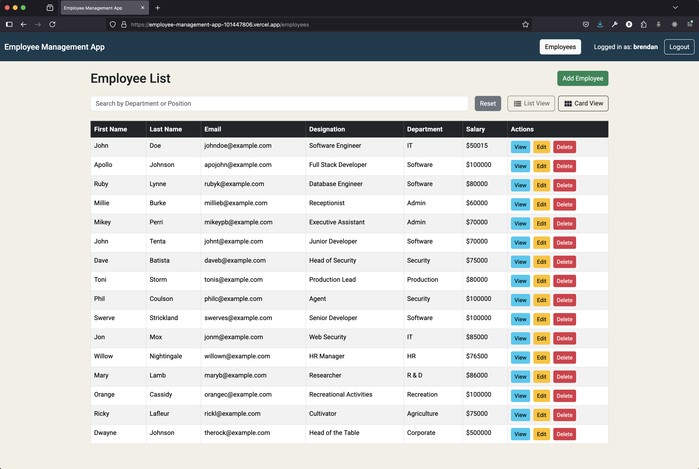
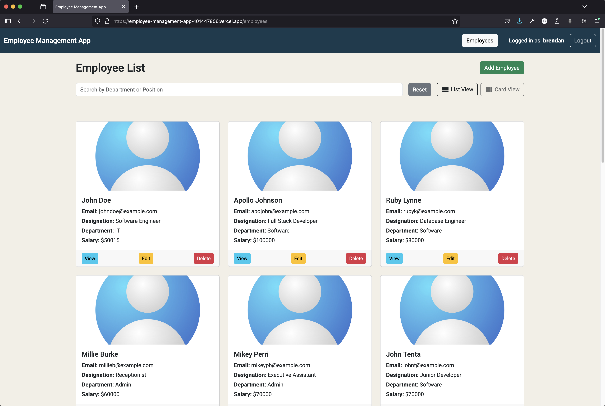
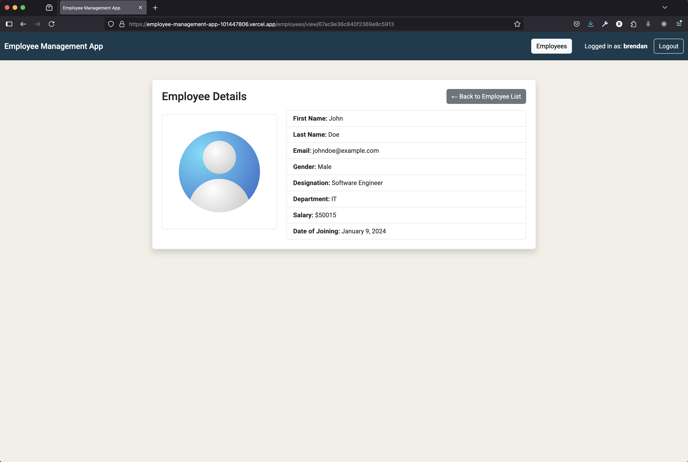
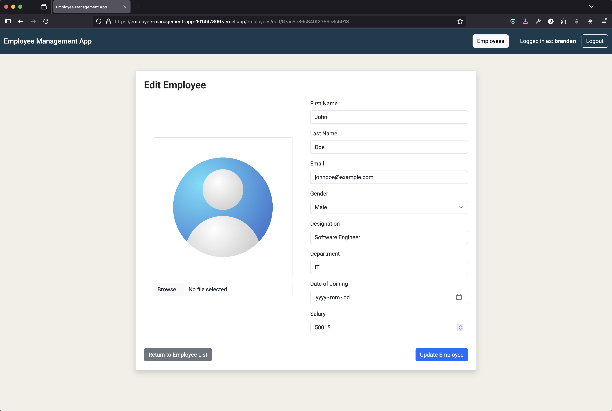
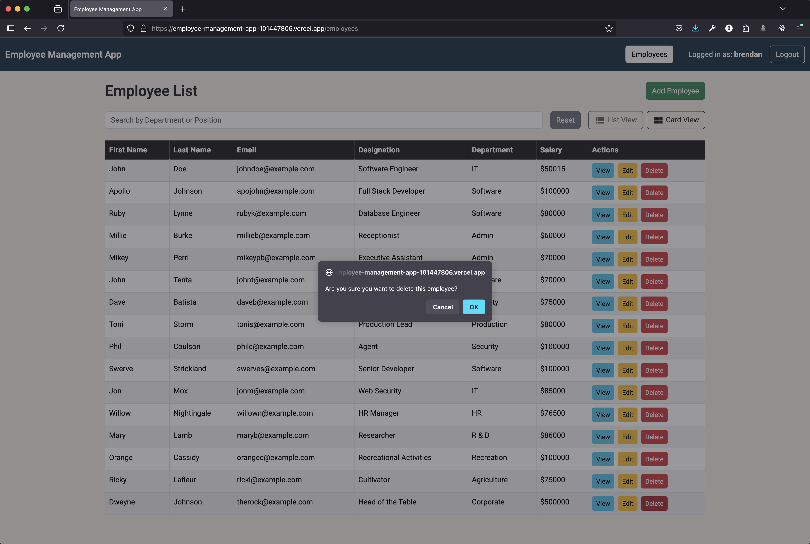
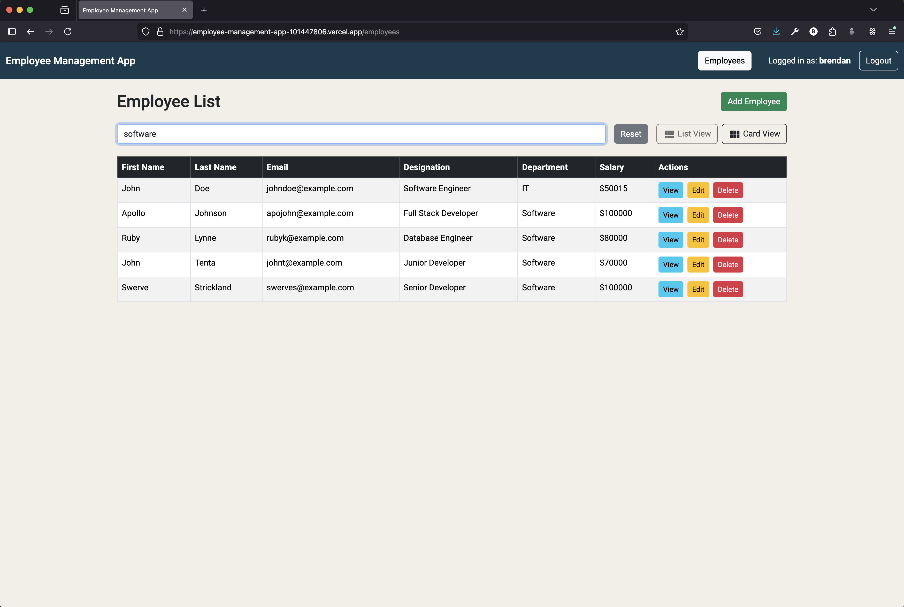
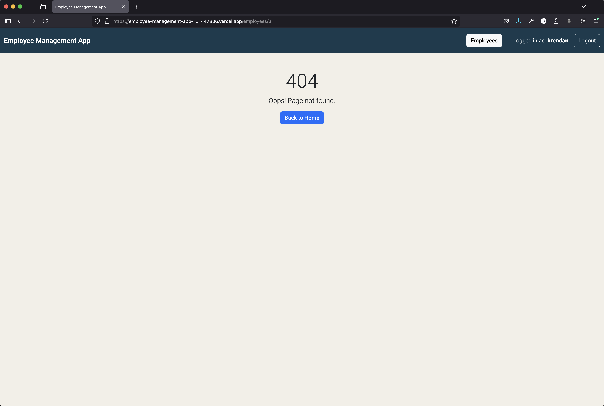

# Employee Management App 🧑‍💼📋

A full-stack MEAN application for managing employees — featuring login/signup, CRUD operations, image uploads, search, responsive layout, and more.

## 🔗 Live Demo

**Frontend (Vercel):** [https://employee-management-app-101447806.vercel.app/](https://employee-management-app-101447806.vercel.app/)  
**Backend (Render):** [https://github.com/BrendanDasilva/Employee_Management_App--fullstack--MEAN--backend](https://github.com/BrendanDasilva/Employee_Management_App--fullstack--MEAN--backend)

---

## 📸 Screenshots

> 📷 Add screenshots to the `/screenshots` folder after running the app.

| Feature                    | Screenshot                                       |
| -------------------------- | ------------------------------------------------ |
| Login Page                 |                   |
| Signup Page                |                 |
| Employee List (Table View) |  |
| Employee List (Card View)  |  |
| Employee Details View      |         |
| Add Employee               |              |
| Edit Employee              |            |
| Delete Employee            |        |
| Search Employees           |                 |
| Page Not Found             |            |

---

## 🛠️ Tech Stack

- **Frontend:** Angular 16+
- **Backend:** Node.js + Express + Apollo Server
- **Database:** MongoDB Atlas
- **GraphQL:** Apollo Angular & Server
- **File Uploads:** `graphql-upload`, `multer`
- **Deployment:**
  - Frontend: Vercel
  - Backend: Render

---

## ✨ Features

- 🔐 JWT-based Authentication
- 👥 Employee CRUD Operations
- 🔍 Advanced Employee Search
- 🖼️ Profile Picture Uploads
- ✅ Form Validations
- 🛡️ Protected Routes with Auth Guards
- 🌓 Responsive Design: Table & Card Views
- ❌ Custom 404 Page

---

## 🚀 Getting Started (Local Dev)

### 1. Clone the repos

```bash
git clone https://github.com/BrendanDasilva/Employee_Management_App--fullstack--MEAN--backend
git clone https://github.com/BrendanDasilva/Employee_Management_App--fullstack--MEAN--frontend
```

### 2. Setup Backend

```bash
cd backend
npm install
touch config.env

Example config.env file:

MONGO_URI=your_mongo_connection_string
JWT_SECRET=your_jwt_secret
NODE_ENV=development

npm start
```

### 3. Setup Frontend

```bash
cd frontend
npm install
ng serve

Open: http://localhost:4200
```

### 📁 Folder Structure

```bash
frontend/
├── app/
│   ├── components/         # Angular pages & components
│   ├── services/           # GraphQL service, auth, employee service
│   └── ...
└── app.config.ts           # Apollo client + routing setup

backend/
├── resolvers/              # GraphQL resolvers
├── schemas/                # GraphQL typeDefs
├── models/                 # Mongoose schemas
├── middlewares/            # Upload middleware
├── config/                 # DB connection config
└── server.js               # Express + Apollo Server setup
```

### ✅ Future Improvements

```bash
    📊 Admin Dashboard

    🌐 Pagination / Sorting

    📤 CSV Export

    🔐 Role-based Access

    💬 Toast notifications
```

### 👨‍💻 Author

BrendanDasilva
GitHub: @BrendanDasilva
